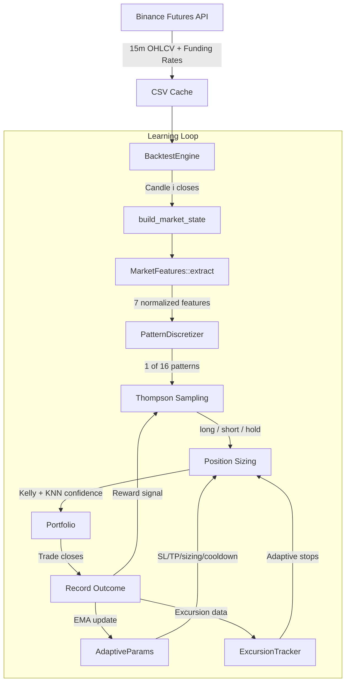
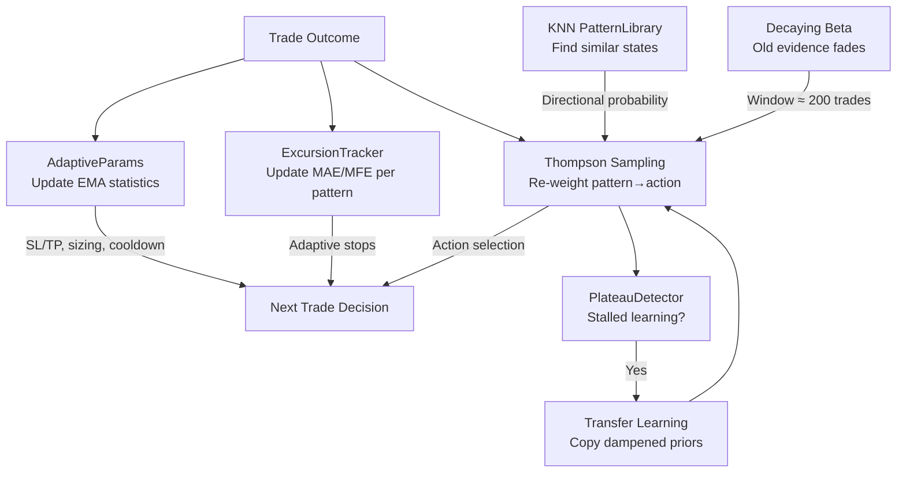

# RDEX

**Fully autonomous, self-improving crypto trading system** that discovers profitable patterns from Binance Futures data using Thompson Sampling with cross-symbol transfer learning.

The system learns everything from data. It is never told what to trade, when to trade, or how much to risk. Zero hardcoded constants, zero manual rules — every parameter adapts from observed trade outcomes.

## How It Works



## Key Features

- **Thompson Sampling** — contextual bandit selects long/short/hold per market pattern, with decaying evidence for non-stationary markets
- **Adaptive Parameters** — SL/TP, trailing stops, cooldowns, hold limits, and position sizing all derived from EMA statistics of trade outcomes
- **Signal Flip Guard** — direction reversals blocked during adaptive min_hold period, preventing noisy Thompson samples from causing premature exits
- **KNN Pattern Library** — temporal feature vectors find similar historical states to predict direction and inform Thompson priors
- **Cross-Symbol Transfer** — patterns learned on BTC accelerate learning on altcoins through dampened prior transfer
- **Walk-Forward Validation** — 3-fold out-of-sample testing with Monte Carlo permutation tests to reject overfitting
- **Realistic Simulation** — Binance Futures mechanics including leverage, taker fees, slippage, 8-hour funding rates, and liquidation

## Quick Start

```bash
# Build
cargo build --release

# Fetch 30 days of data for default symbols
cargo run --bin rdex -- fetch -d 30

# Run backtest with $10,000 starting equity
cargo run --bin rdex -- backtest -d 30 -e 10000

# Custom symbols and leverage
cargo run --bin rdex -- backtest -d 60 -e 25000 -l 5 -s BTCUSDT,ETHUSDT,SOLUSDT
```

### CLI Flags

| Flag | Default | Description |
|------|---------|-------------|
| `-d` | 30 | Days of historical data |
| `-e` | 10000 | Starting equity (USD) |
| `-l` | 3 | Leverage multiplier |
| `-s` | 8 major pairs | Comma-separated symbol list |

Default symbols: BTCUSDT, ETHUSDT, SOLUSDT, BNBUSDT, XRPUSDT, DOGEUSDT, AVAXUSDT, LINKUSDT

## Architecture

```mermaid
graph LR
    subgraph domain["domain/"]
        types[types.rs<br/>Candle, Symbol, MarketState]
        crypto[crypto_domain.rs<br/>build_market_state]
        indicators[indicators.rs<br/>SMA, EMA, RSI, ATR, MACD, BB, ADX]
    end

    subgraph strategy["strategy/"]
        features[features.rs<br/>7 normalized features]
        patterns[patterns.rs<br/>16-pattern discretizer]
    end

    subgraph engine["engine/"]
        thompson[thompson.rs<br/>DecayingBeta bandit]
        learner[learner.rs<br/>LearningEngine orchestrator]
        adaptive[adaptive.rs<br/>AdaptiveParams EMAs]
        patlib[pattern_library.rs<br/>KNN predictions]
        transfer[transfer.rs<br/>Cross-symbol transfer]
        trades[trade_manager.rs<br/>Position lifecycle]
    end

    subgraph backtest["backtest/"]
        btengine[engine.rs<br/>Candle-by-candle simulation]
        portfolio[portfolio.rs<br/>Equity, fees, liquidation]
        validation[validation.rs<br/>Walk-forward, permutation]
    end

    subgraph evaluation["evaluation/"]
        metrics[metrics.rs<br/>Sharpe, Sortino, Calmar...]
        scorer[scorer.rs<br/>Adaptive sigmoid reward]
    end

    subgraph data["data/"]
        fetcher[fetcher.rs<br/>Binance FAPI client]
        cache[cache.rs<br/>CSV persistence]
    end

    domain --> strategy --> engine --> backtest
    evaluation --> engine
    data --> backtest
```



## Self-Improvement Feedback Loops

The system has 7 concurrent feedback loops that drive autonomous adaptation:



## Two-Phase Backtest

```mermaid
graph LR
    subgraph Phase 1: Learning
        BTC[BTC] --> ETH[ETH] --> SOL[SOL] --> BNB[BNB]
        BNB --> XRP[XRP] --> DOGE[DOGE] --> AVAX[AVAX] --> LINK[LINK]
    end

    subgraph Phase 2: Exploitation
        Rerun[Re-run all symbols<br/>with trained engine]
        WF[Walk-Forward<br/>3 folds]
        MC[Monte Carlo<br/>Permutation test]
        Rerun --> WF --> MC
    end

    Phase 1: Learning --> Phase 2: Exploitation
```

## Recent Performance (30-day backtest, $10K, 3x leverage)

| Symbol | Return | Trades | Win Rate | Sharpe | Max DD | PF |
|--------|--------|--------|----------|--------|--------|-----|
| BTCUSDT | +13.45% | 88 | 61.4% | 8.00 | 2.61% | 1.90 |
| ETHUSDT | +25.15% | 91 | 63.7% | 11.48 | 4.34% | 2.56 |
| SOLUSDT | +38.38% | 94 | 66.0% | 11.85 | 4.56% | 3.70 |
| BNBUSDT | +33.46% | 97 | 70.1% | 14.52 | 2.52% | 2.94 |
| XRPUSDT | +36.90% | 93 | 71.0% | 14.29 | 6.92% | 2.50 |
| DOGEUSDT | +40.86% | 102 | 67.6% | 15.17 | 5.71% | 3.16 |
| AVAXUSDT | +36.04% | 89 | 66.3% | 13.34 | 4.82% | 2.62 |
| LINKUSDT | +49.35% | 100 | 69.0% | 12.71 | 5.66% | 3.81 |
| **Portfolio** | **+34.20%** | **754** | **67.0%** | **12.67** | **6.92%** | — |

Walk-forward valid: 5/8 symbols. Permutation test significant: 1/8 (DOGE p=0.009).

## Performance Metrics

The backtest produces 30+ metrics including:

| Category | Metrics |
|----------|---------|
| Risk/Return | Total return, annualized return, Sharpe, Sortino, Calmar, recovery factor |
| Drawdown | Max drawdown %, duration, time underwater, drawdown count |
| Trade Stats | Win rate, profit factor, expectancy, avg win/loss, best/worst trade |
| Consistency | Max consecutive wins/losses, trade frequency, avg holding period |
| Long/Short | Separate win rates, avg P&L, trade counts |
| Excursion | Avg MAE/MFE, trade efficiency (capture ratio), losers-that-were-winners |
| Confidence | Calibration by bucket (low/med/high/vhi) |
| Sizing | Position size distribution, size-PnL correlation |
| Fees | Fee impact as % of gross profit, avg fee per trade |
| Streaks | Win/loss streak averages, maximums, counts |

Each trade record includes: pattern, confidence, Thompson reward, entry ATR, exit reason, MAE/MFE, equity at entry/exit.

## Validation

Every strategy change must pass:

1. **Walk-forward validation** — majority of folds profitable out-of-sample, CV < 2.0, degradation < 50%
2. **Permutation test** — p-value < 0.05 (trade ordering matters → genuine edge)
3. **Overfitting check** — Sharpe < 5.0, return < 100%, consistent across symbols

## Design Principles

- **Zero constants** — every trading parameter learned from data via EMAs, Kelly, excursion statistics
- **Anti-look-ahead** — runtime assertions enforce that candle `i` only sees data `[0..=i]`
- **Adaptive risk** — SL/TP from excursion EMAs, sizing from Kelly criterion, cooldowns from win/loss ratios
- **Small pattern space** — 16 patterns (4 features × 2 bins) ensures enough data per pattern
- **Decaying evidence** — Beta distributions decay with factor 0.995 (window ≈ 200 trades) for regime adaptation

## Documentation

| Doc | Topic |
|-----|-------|
| [01-overview](docs/01-overview.md) | Mission, philosophy, self-improvement loops |
| [02-architecture](docs/02-architecture.md) | Module map, data flow, responsibility boundaries |
| [03-thompson-sampling](docs/03-thompson-sampling.md) | DecayingBeta, arm selection, hold bias, reward signal |
| [04-adaptive-parameters](docs/04-adaptive-parameters.md) | EMA statistics, all derived parameter formulas |
| [05-pattern-recognition](docs/05-pattern-recognition.md) | Feature extraction, median-split binning, excursion tracking |
| [06-backtest-engine](docs/06-backtest-engine.md) | Anti-look-ahead, per-candle loop, position lifecycle |
| [07-portfolio-and-risk](docs/07-portfolio-and-risk.md) | Fee/slippage/liquidation model, P&L calculation |
| [08-validation](docs/08-validation.md) | Walk-forward, permutation test, overfitting checks |
| [09-transfer-learning](docs/09-transfer-learning.md) | RegretTracker, PlateauDetector, transfer process |
| [10-indicators](docs/10-indicators.md) | 14 technical indicators, regime classification |

## Tech Stack

- **Rust** — single binary, zero dependencies beyond crates
- **Binance FAPI** — public API, no authentication required
- **Thompson Sampling** — `statrs` crate for Beta distribution sampling
- **CSV caching** — 1-hour TTL, automatic refetch

## Testing

290 unit tests across 17 modules:

```bash
cargo test --lib              # Run all tests
cargo test --lib test_name    # Run specific test
cargo clippy                  # Lint
cargo fmt -- --check          # Format check
```

## License

MIT
