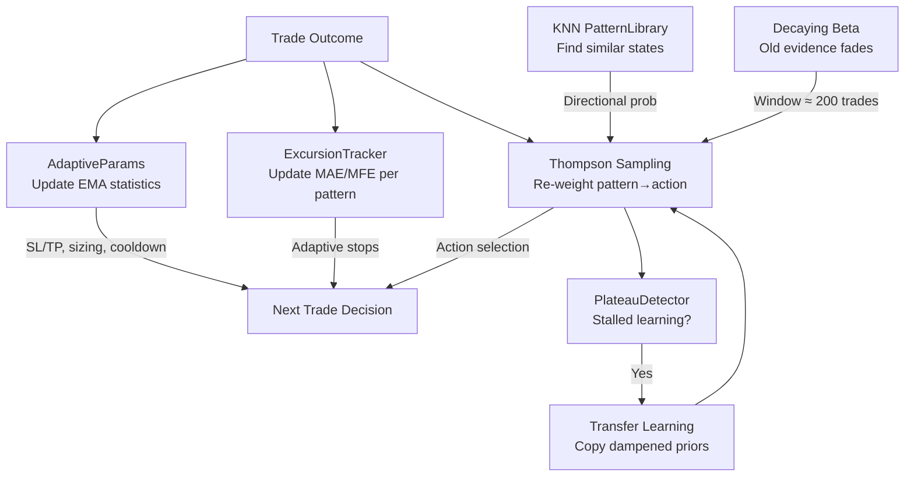
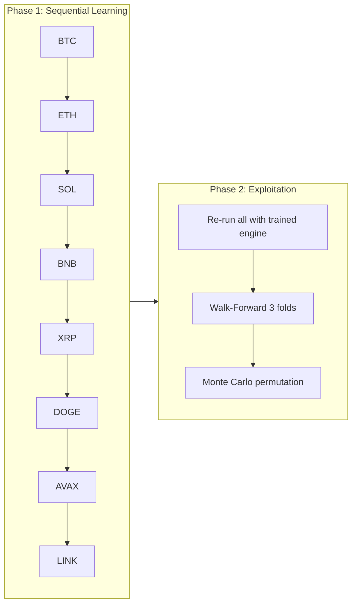
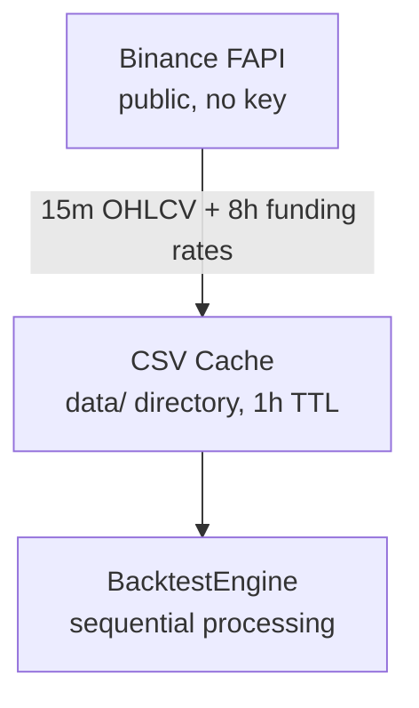

# 01 — System Overview

## Mission

RDEX is a **fully autonomous, self-improving crypto trading system**. It discovers profitable patterns from Binance Futures 15-minute candle data, adapts to changing market conditions, and continuously improves its own performance — all without human intervention.

**The system learns everything from data. It is never told what to trade, when to trade, or how much to risk.**

## Core Philosophy

1. **ZERO constants, ZERO hardcoded values.** Every trading parameter — position sizing, stop loss, take profit, hold duration, cooldown, trailing stops — is learned from observed trade outcomes. No thresholds, no magic numbers, no manually tuned constants anywhere in strategy or risk logic. If it influences a trade, it must come from data.
2. **Self-improving.** The system adapts to evolving markets: Thompson Sampling continuously re-weights what works, AdaptiveParams EMAs shift with recent outcomes, and PlateauDetector triggers transfer learning when progress stalls. As markets change, the system changes with them.
3. **Maximize profits through better learning.** Richer features, sharper pattern recognition, faster Thompson convergence, and tighter KNN predictions — these are the levers for profit. Never hand-crafted trading rules.
4. **Prevent losses through adaptive risk management.** SL/TP derive from excursion EMAs, cooldowns from win/loss duration ratios, sizing from Kelly criterion, hold limits from observed trade durations. When performance degrades, risk management automatically tightens.
5. **Anti-look-ahead enforcement.** The backtest engine asserts at runtime that no future data leaks into decisions. `MarketState` at candle `i` only contains candles `[0..=i]`.
6. **Cross-domain transfer.** Patterns learned on high-liquidity symbols (BTC) accelerate learning on smaller ones (DOGE, AVAX) through dampened prior transfer.
7. **Validate everything.** Strategy changes must demonstrate improvement in backtest metrics (return, Sharpe, drawdown). Walk-forward validation and permutation tests guard against overfitting.

## How the System Self-Improves

The system has multiple feedback loops that drive autonomous improvement:



| Loop | Mechanism | Adapts to |
|------|-----------|-----------|
| **Thompson Sampling** | Rewards winning pattern→action pairs, decays losers | Which trades work in which conditions |
| **AdaptiveParams EMAs** | Updates SL/TP/sizing/cooldown from every trade outcome | Changing volatility, win rates, trade durations |
| **ExcursionTracker** | Learns per-pattern, per-side favorable/adverse moves | How far trades run before reversing |
| **PlateauDetector** | Detects stalled learning, triggers exploration or transfer | When current strategy stops improving |
| **Transfer Learning** | Copies dampened priors from data-rich to data-poor symbols | Cold-start on new or thin symbols |
| **KNN PatternLibrary** | Finds similar historical market states, predicts direction | Recurring market microstructure |
| **Decaying Beta** | Exponential decay on old evidence (window ≈ 200 trades) | Regime shifts — old patterns fade |

## Two-Phase Backtest



One shared `LearningEngine` processes symbols in order. Each symbol's patterns accumulate into the shared Thompson engine. Phase 2 re-runs all symbols with the fully trained engine, then validates.

## CLI

```
rdex backtest -d 30 -e 10000 -l 3 -s BTCUSDT,ETHUSDT
rdex fetch -d 30 -s BTCUSDT,ETHUSDT
```

| Flag | Default | Description |
|------|---------|-------------|
| `-d` | 30 | Days of historical data |
| `-e` | 10000 | Starting equity ($) |
| `-l` | 3 | Leverage multiplier |
| `-s` | 8 major pairs | Comma-separated symbol list |

## Data Pipeline


