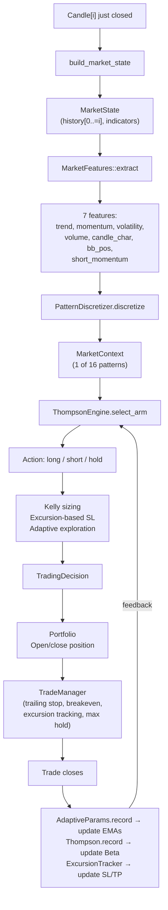

# 02 — Architecture

## Module Map

```
src/
├── lib.rs                    # Re-exports all modules
├── main.rs                   # CLI (clap): backtest + fetch subcommands
│
├── domain/                   # Pure data types, no business logic
│   ├── types.rs             # Candle, Symbol, MarketState, IndicatorSet,
│   │                        #   TradingDecision, TradeSignal, Position,
│   │                        #   MarketContext, StrategyId, FundingRate
│   ├── crypto_domain.rs     # FuturesConfig (leverage, fees, slippage),
│   │                        #   build_market_state(), extract_context()
│   └── indicators.rs        # compute_indicators() — SMA, EMA, RSI, ATR,
│                            #   MACD, Bollinger Bands, ADX, volume SMA
│
├── strategy/                 # Feature extraction & pattern recognition
│   ├── features.rs          # MarketFeatures (7 normalized features + raw ATR/price)
│   └── patterns.rs          # PatternDiscretizer — adaptive median-split
│                            #   4 features × 2 bins = 16 patterns
│
├── engine/                   # Decision-making & learning core
│   ├── thompson.rs          # Thompson Sampling (DecayingBeta, ThompsonEngine)
│   ├── learner.rs           # LearningEngine — orchestrates everything
│   ├── adaptive.rs          # AdaptiveParams — derives all trading params from data
│   ├── pattern_library.rs   # KNN pattern library — temporal vectors, directional predictions
│   ├── transfer.rs          # RegretTracker, PlateauDetector, TransferVerification
│   └── trade_manager.rs     # TradeManager — position lifecycle (SL/TP, trailing, excursions)
│
├── backtest/                 # Simulation framework
│   ├── engine.rs            # BacktestEngine — candle-by-candle simulation
│   ├── portfolio.rs         # Portfolio — equity, positions, fees, liquidation
│   └── validation.rs        # Walk-forward validation, permutation tests, overfitting checks
│
├── evaluation/               # Performance measurement
│   ├── metrics.rs           # Sharpe, Sortino, Calmar, max drawdown, profit factor, etc.
│   └── scorer.rs            # pnl_to_reward() — adaptive sigmoid for Thompson feedback
│
└── data/                     # External data management
    ├── fetcher.rs           # Async Binance FAPI client (candles + funding rates)
    └── cache.rs             # CSV serialization with temporal ordering verification
```

## Data Flow



## Key Responsibility Boundaries

| Component | Owns | Does NOT own |
|-----------|------|--------------|
| `BacktestEngine` | Candle iteration, anti-look-ahead, funding fees, portfolio orchestration | Trading logic, learning, position state |
| `TradeManager` | SL/TP, trailing stops, excursion tracking, cooldown, exit reasons | Portfolio equity, order execution |
| `LearningEngine` | Feature→pattern→action pipeline, Thompson state, excursion tracker | Position management, portfolio |
| `PatternLibrary` | KNN temporal vectors, directional probability predictions, per-symbol/global stores | Decision making, position management |
| `AdaptiveParams` | All EMA-based trading parameters | Decision making |
| `Portfolio` | Equity, position tracking, fee/slippage/liquidation calculation | When to trade |
