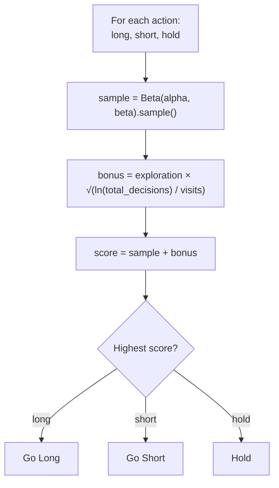
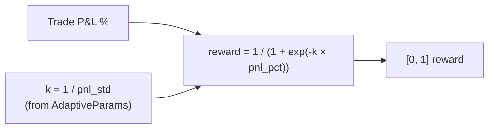
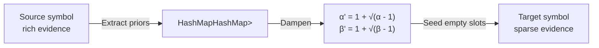

# 03 — Thompson Sampling Engine

## Overview

The system uses Thompson Sampling to select between three actions (`long`, `short`, `hold`) for each market pattern. This is a contextual bandit with decaying evidence for non-stationary markets.

## Key Types

### `BetaParams`
Standard Beta distribution parameterized by `alpha` (successes) and `beta` (failures). Starts at `Uniform(1, 1)`. Sampling uses the `statrs` crate for mathematically correct Beta distribution sampling.

### `DecayingBeta`
Wraps `BetaParams` with an exponential decay factor (default 0.995). Before each update, old evidence is decayed toward the prior:

```
alpha = 1 + (alpha - 1) * decay_factor
beta  = 1 + (beta  - 1) * decay_factor
```

This gives an effective observation window of `1 / (1 - decay_factor)` ≈ 200 trades.

### `ThompsonEngine`
Three-level nested HashMap: `symbol → MarketContext → StrategyId → DecayingBeta`

**Global pooling:** All symbols share a single Thompson state under the `_global` key. Crypto markets have similar microstructure, so patterns learned on BTC apply to ETH.

## Arm Selection



The curiosity bonus is UCB-like and decays as each arm accumulates visits.

## Hold Bias

New arms start with `Uniform(1, 1)` except `hold`, which gets an inflated alpha:

```
hold_alpha = 1 + 4 / (1 + total_decisions / 100)
```

This creates a conservative bias early on that naturally decays as the engine gains experience.

## Reward Signal

Trade P&L is converted to `[0, 1]` via adaptive sigmoid:



Where `k = 1 / pnl_std` (adaptive, from `AdaptiveParams`). Small trades → steep sigmoid. Large trades → gentle gradient.

## Transfer Learning

When a source symbol has accumulated enough evidence (>10 effective observations per arm):



Dampening prevents source symbol's strong convictions from overwhelming the target's local learning.
