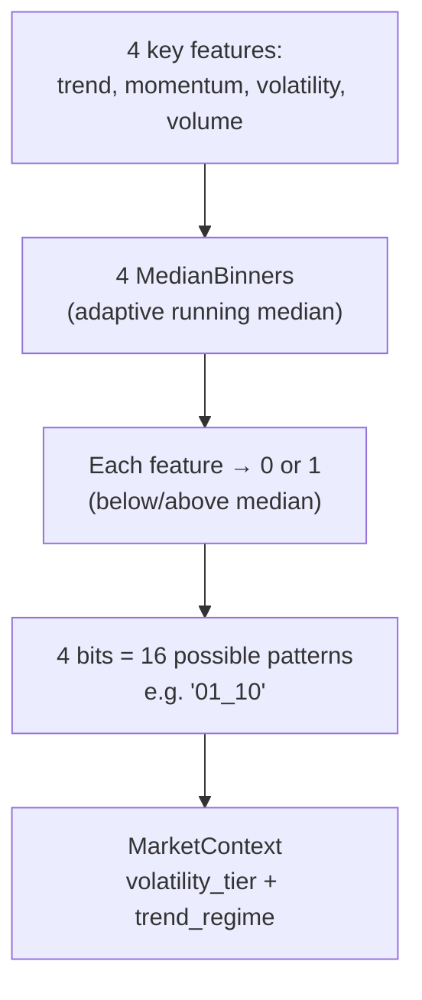
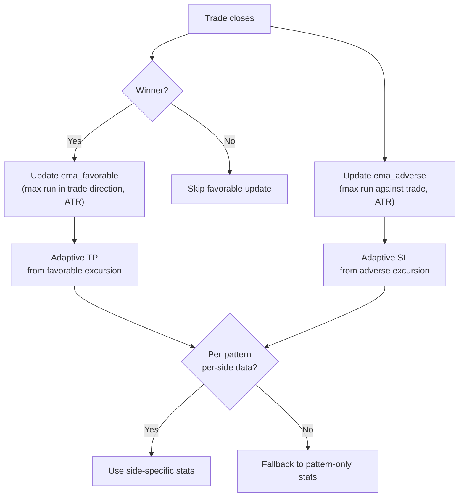

# 05 — Pattern Recognition

## Feature Extraction

`MarketFeatures::extract()` produces 7 normalized features from `MarketState`:

| Feature | Range | Derivation |
|---------|-------|------------|
| `trend` | [-1, 1] | tanh(weighted distance from SMA20/SMA50 + MA spread, normalized by ATR) |
| `momentum` | [-1, 1] | tanh(RSI deviation from 50 + MACD histogram / ATR) |
| `volatility` | [0, 1] | BB width ratio * 12.5 blended with ADX / 50 |
| `volume` | [0, 1] | (current volume / SMA20 volume - 1) / 2 + 0.5 |
| `candle_character` | [-1, 1] | (close - open) / range * body_ratio |
| `bb_position` | [0, 1] | (price - BB_lower) / (BB_upper - BB_lower) |
| `short_momentum` | [-1, 1] | tanh(5-bar return / ATR) |

Plus raw `atr` and `price` for SL/TP and sizing calculations.

## Adaptive Median-Split Binning

### Why 16 patterns?

Small pattern space ensures each pattern gets enough observations for Thompson Sampling to learn effectively. With 3 actions per pattern, that's 48 arms total — manageable with ~200 trades.

### Adaptive Boundaries

Each `MedianBinner` maintains the most recent 3000 observations and recomputes the median after every 20 new observations. This means the "what counts as high trend" adapts to the current market regime.

### Pattern Encoding

Patterns are encoded as `MarketContext` with two 2-character strings:
- `volatility_tier`: first 2 bins (trend, momentum)
- `trend_regime`: last 2 bins (volatility, volume)

Example: `"01_10"` means trend=low, momentum=high, volatility=high, volume=low.

Pattern key for lookups: `"01_10"` (joined with underscore).

## Excursion Tracking

`ExcursionTracker` maintains per-pattern, per-side decaying statistics of:
- **Favorable excursion:** Maximum run in the trade's direction (ATR multiples) for winning trades
- **Adverse excursion:** Maximum run against the trade (ATR multiples) for all trades

These feed into adaptive SL (from adverse) and TP (from favorable) with decay factor 0.95. Falls back from side-specific to pattern-only stats for cold-start situations.
