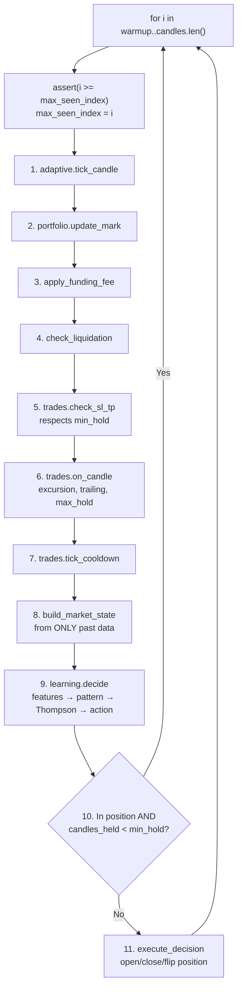
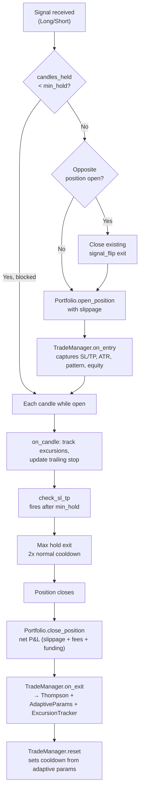

# 06 — Backtest Engine

## Role

`BacktestEngine` is purely a simulation orchestrator. It feeds candles to the learning engine and manages the portfolio. All trading logic (SL/TP, trailing, cooldowns) lives in `TradeManager` and `LearningEngine`.

## Anti-Look-Ahead Guarantees

1. **Temporal ordering assertion:** Panics if `candles[i].open_time < candles[i-1].open_time`
2. **Monotonic index assertion:** `max_seen_index` only increases; panics if processing a candle at index < `max_seen_index`
3. **MarketState construction:** `build_market_state(symbol, candles, i, lookback)` only uses `candles[start..=i]`
4. **Indicator computation:** `compute_indicators()` operates on the passed slice only

## Per-Candle Loop

## Signal Flip Guard

When holding a position, the system blocks `execute_decision` until `candles_held >= adaptive.min_hold()`. This prevents noisy Thompson samples from causing premature direction reversals (signal flips). During the min_hold period, the stop loss still handles risk protection.

This was the single most impactful improvement found through iterative testing — it reduced signal flip exits by 74%, cut total trades by 58%, and improved returns by 220% (from +10.68% to +34.20% avg across 8 symbols).

New decisions are only executed when:
- **No position open** — normal entry path
- **Position held past min_hold** — signal flips allowed after the position has matured

## Funding Fee Handling

Binance Futures funding occurs every 8 hours (00:00, 08:00, 16:00 UTC). The engine checks each 8-hour boundary within the current candle's time range and looks up the actual rate from a HashMap. Default rate 0.0 if not available (no data = no fee).

- **Long + positive rate:** Longs pay
- **Short + positive rate:** Shorts receive
- Accumulated funding fees are deducted from P&L at position close.

## Position Lifecycle

## Results Output

`BacktestResult` contains:
- `PerformanceMetrics` (30+ metrics)
- Full `Vec<TradeRecord>` with extended analysis fields
- `final_equity`
- `health` report per symbol (regret, observations, learning status)

Detailed output includes: per-symbol breakdown, exit reason distribution, pattern performance table, full trade log with MAE/MFE/confidence/equity, drawdown analysis, confidence calibration, holding period distribution, position sizing analysis, fee impact, streak analysis, and trade efficiency (MAE/MFE capture ratios).
