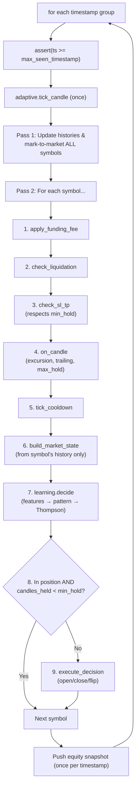
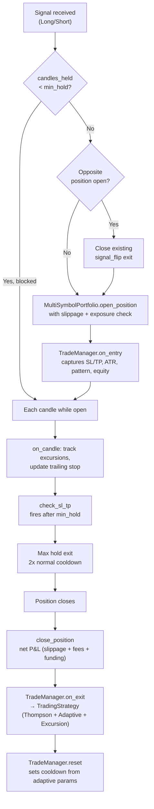

# 06 — Backtest Engine

## Overview

Two backtest engines exist:

| Engine | Use Case | Portfolio |
|--------|----------|-----------|
| `InterleavedEngine` | **Primary.** Multi-symbol, single-pass, shared equity | `MultiSymbolPortfolio` |
| `BacktestEngine` | Legacy. Single-symbol backtests | `Portfolio` |

Both are simulation orchestrators only. All trading logic (SL/TP, trailing, cooldowns) lives in `TradeManager` and `LearningEngine`, accessed through the `TradingStrategy` trait.

## InterleavedEngine (Primary)

The `InterleavedEngine` processes all symbols simultaneously in a single chronological pass:

1. Merge all symbols' candles into one timeline, sorted by `open_time`
2. Group by timestamp (all symbols at the same 15-minute interval)
3. For each timestamp group:
   - **Pass 1:** Update candle histories and mark-to-market for ALL symbols (stable equity)
   - **Pass 2:** Process trading decisions per symbol using the stable equity figure
   - Push one equity curve snapshot
4. Close remaining positions at end of data

### Why Two Passes?

Without the two-pass split, symbols processed first at a given timestamp would see stale equity from other symbols' unrealized P&L. Pass 1 ensures all marks are current before any decisions execute, eliminating a subtle timing bias.

## Anti-Look-Ahead Guarantees

### InterleavedEngine
1. **Timeline sorting:** All candles sorted by `open_time` before processing
2. **Monotonic timestamp assertion:** `max_seen_timestamp` only increases; panics on violation
3. **Per-symbol candle history:** Each symbol builds its own history incrementally
4. **MarketState construction:** `build_market_state()` only uses candles up to current index
5. **Online learning:** `LearningEngine` learns from each trade as it happens — no pre-training

### BacktestEngine (legacy)
1. **Temporal ordering assertion:** Panics if `candles[i].open_time < candles[i-1].open_time`
2. **Monotonic index assertion:** `max_seen_index` only increases
3. **MarketState construction:** `build_market_state(symbol, candles, i, lookback)` only uses `candles[start..=i]`
4. **Indicator computation:** `compute_indicators()` operates on the passed slice only

## Interleaved Per-Timestamp Loop



## Signal Flip Guard

When holding a position, the system blocks `execute_decision` until `candles_held >= adaptive.min_hold()`. This prevents noisy Thompson samples from causing premature direction reversals (signal flips). During the min_hold period, the stop loss still handles risk protection.

New decisions are only executed when:
- **No position open** — normal entry path
- **Position held past min_hold** — signal flips allowed after the position has matured

## Funding Fee Handling

Binance Futures funding occurs every 8 hours (00:00, 08:00, 16:00 UTC). The engine checks each 8-hour boundary within the current candle's time range and looks up the actual rate from a per-symbol HashMap. Default rate 0.0 if not available (no data = no fee).

- **Long + positive rate:** Longs pay
- **Short + positive rate:** Shorts receive
- Accumulated funding fees are deducted from P&L at position close.

## Position Lifecycle



## TradingStrategy Trait

`TradeManager` methods accept `&impl TradingStrategy` instead of `&LearningEngine` directly. This means the same `TradeManager` position lifecycle code works for both backtest and live trading:

```rust
pub trait TradingStrategy {
    fn decide(&mut self, state: &MarketState, rng: &mut impl Rng, library: &PatternLibrary) -> TradingDecision;
    fn adaptive(&self) -> &AdaptiveParams;
    fn adaptive_mut(&mut self) -> &mut AdaptiveParams;
    fn record_outcome(&mut self, symbol: &str, context: &MarketContext, strategy_id: &StrategyId, reward: f64);
    fn record_excursion(&mut self, pattern_key: &str, side: &str, favorable_atr: f64, adverse_atr: f64, won: bool);
    fn record_hold(&mut self, symbol: &str, pattern: &MarketContext, recent_return: f64);
    fn last_pattern(&self) -> Option<&MarketContext>;
    fn last_prediction(&self) -> Option<f64>;
    fn tick_candle(&mut self);
}
```

A live executor only needs to: feed candles → build `MarketState` → call `decide()` → execute via broker API → call `record_outcome()` on close.

## Results Output

`BacktestResult` contains:
- `PerformanceMetrics` (30+ metrics)
- Full `Vec<TradeRecord>` with extended analysis fields
- `final_equity`
- `health` report per symbol (regret, observations, learning status)

Detailed output includes: per-symbol breakdown, exit reason distribution, pattern performance table, drawdown analysis, confidence calibration, holding period distribution, position sizing analysis, fee impact, streak analysis, and trade efficiency (MAE/MFE capture ratios).
