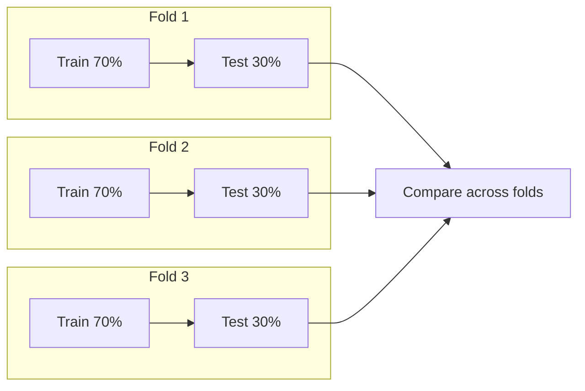
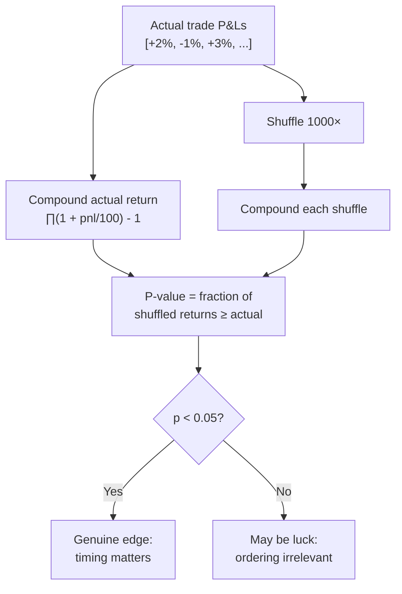
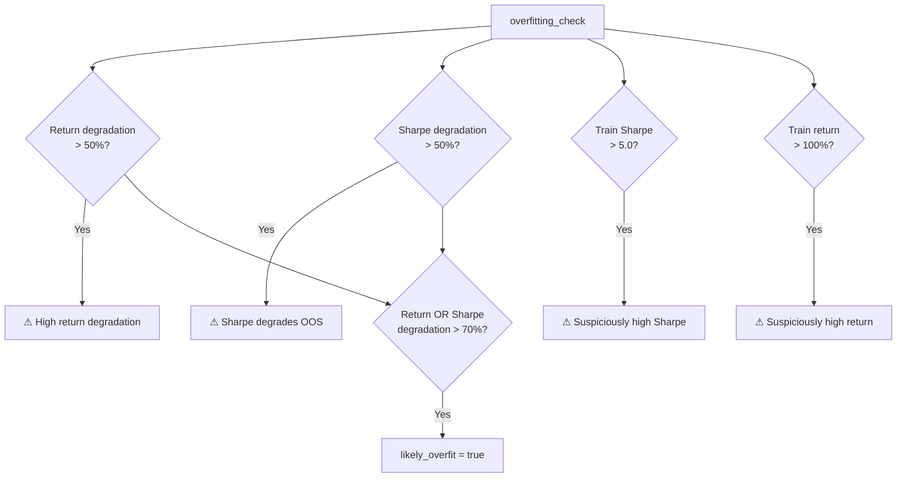

# 08 — Validation Framework

## Walk-Forward Validation

Prevents overfitting by training and testing on non-overlapping time segments.



```
walk_forward_validation(symbol, candles, config, learner_config, n_folds=3, train_ratio=0.7)
```

For each fold:
1. Split data: 70% train, 30% test
2. Train a fresh `LearningEngine` on the training segment
3. Run the trained engine on the test segment (test includes train prefix for indicator warmup)
4. Record: train return, test return, test Sharpe, test drawdown, test trades, test win rate

### Validity Criteria

A validation is deemed **valid** if:
- Majority of folds are profitable out-of-sample
- Low coefficient of variation across folds (CV < 2.0)
- Average return degradation from train to test < 50%

## Monte Carlo Permutation Test

Tests whether trade ordering matters (i.e., whether the strategy has genuine edge vs. luck).



Both actual and permuted returns use the same compounding method for apples-to-apples comparison.

## Overfitting Check

```
overfitting_check(train_return, test_return, train_sharpe, test_sharpe)
```


