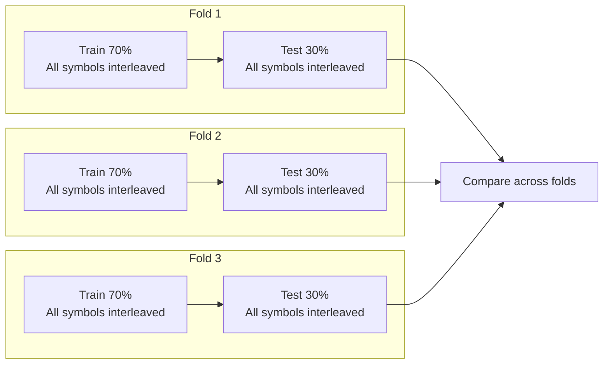
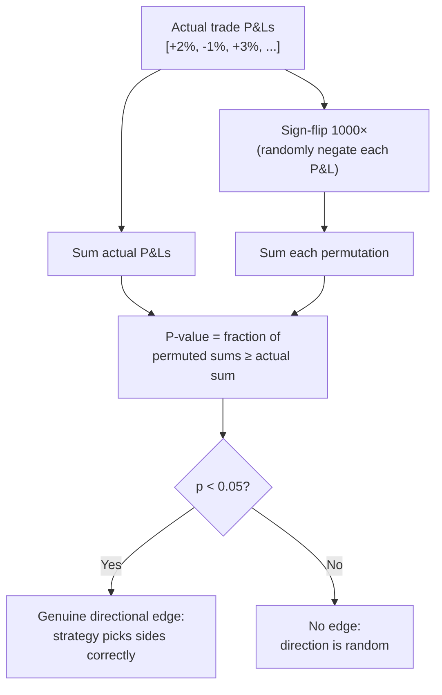
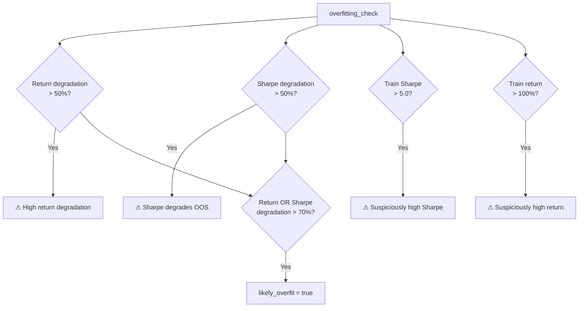

# 08 — Validation Framework

## Walk-Forward Validation

Prevents overfitting by training and testing on non-overlapping time segments. Two implementations exist:

| Function | Engine | Use Case |
|----------|--------|----------|
| `walk_forward_validation_interleaved` | **Primary.** `InterleavedEngine` | Multi-symbol, shared equity |
| `walk_forward_validation` | Legacy. `BacktestEngine` | Single-symbol |

### Interleaved Walk-Forward (Primary)

```
walk_forward_validation_interleaved(symbol_data, all_funding, config, learner_config, n_folds=3, train_ratio=0.7)
```

Splits ALL symbols' data at the same time boundaries, ensuring the multi-symbol interleaved behavior is validated (not a per-symbol approximation):



For each fold:
1. Split ALL symbols at the same index: 70% train, 30% test
2. Train a fresh `InterleavedEngine` on the training segment (all symbols, shared equity)
3. Carry the trained `LearningEngine` forward to the test segment
4. Run on test data with warmup set to the train length (for indicator bootstrapping)
5. Record: train return, test return, test Sharpe, test drawdown, test trades, test win rate

### Legacy Walk-Forward

```
walk_forward_validation(symbol, candles, config, learner_config, n_folds=3, train_ratio=0.7)
```

Single-symbol version using `BacktestEngine`. Same fold logic but operates on one symbol at a time.

### Validity Criteria

A validation is deemed **valid** if:
- Majority of folds are profitable out-of-sample
- Low coefficient of variation across folds (CV < 2.0)
- Average return degradation from train to test < 50%

## Sign-Flip Permutation Test

Tests whether the strategy has genuine directional edge (i.e., picks the right side of trades better than chance).



### Why Sign-Flip (Not Shuffle)?

The null hypothesis is: "the strategy picks direction no better than a coin flip." Sign-flip permutation tests this directly — each trade's P&L is randomly negated, simulating random direction choices while preserving the magnitude distribution. This is more powerful than shuffling trade order, which only tests whether timing matters (a weaker claim).

## Overfitting Check

```
overfitting_check(train_return, test_return, train_sharpe, test_sharpe)
```


