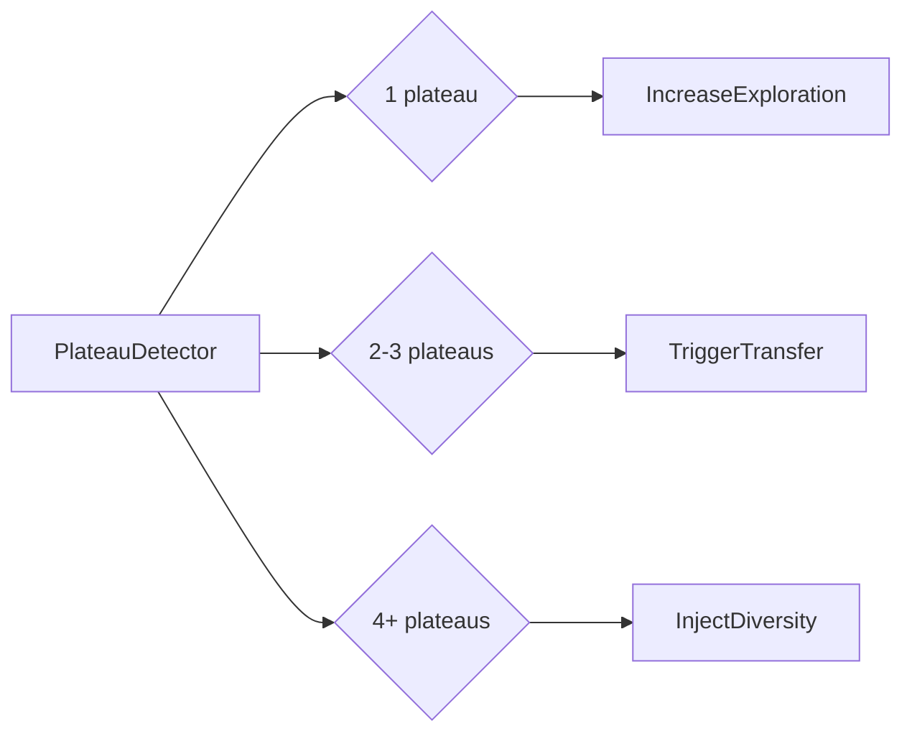
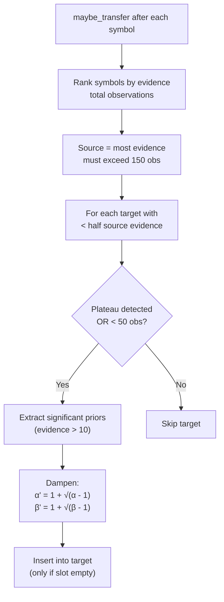

# 09 — Cross-Symbol Transfer Learning

## Motivation

Crypto markets share similar microstructure. A pattern like "high momentum + low volatility → go long" discovered on BTC likely applies to ETH. Transfer learning accelerates convergence on data-poor symbols.

## Components

### RegretTracker

Tracks cumulative regret per symbol:
```
regret_i = best_reward_seen - reward_i
total_regret = Σ regret_i
```

**Growth rate** = `ln(total_regret) / ln(observations)`. Sublinear growth (< 1.0) means the system is learning — regret grows slower than linearly because the engine makes better decisions over time.

### PlateauDetector

Compares recent reward window to prior window. If improvement < threshold for consecutive windows:



Window size: 5, threshold: 0.005 (from `LearnerConfig`).

## Transfer Process



`LearningEngine::maybe_transfer()` runs after each symbol's training:

1. Rank symbols by evidence (total observations)
2. Source = symbol with most evidence (must exceed `transfer_after_n` = 150)
3. For each target with less than half the source's evidence:
   - If plateau detected OR very few observations (<50): transfer
4. `ThompsonEngine::transfer_priors(source, target)`:
   - Extract significant priors (evidence > 10)
   - Dampen: `alpha' = 1 + sqrt(alpha - 1)`
   - Insert into target (only if slot empty — never overwrite local learning)

## Verification

`TransferVerification` evaluates after transfer:
- `improved_target`: target performance improved
- `regressed_source`: source performance degraded (threshold: -0.01)
- `promotable`: improved target AND no source regression
- `acceleration_factor`: baseline_cycles / transfer_cycles

## Symbol Processing Order

Symbols are processed in CLI order. Recommended: start with highest-liquidity symbols (BTC, ETH) so they become transfer sources for smaller alts.
